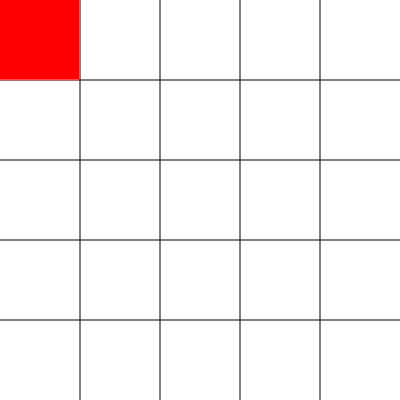
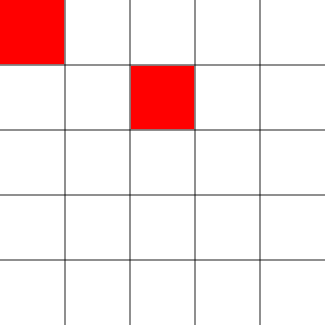

[Home](../README.md) | [Part 2](../Part2/part2.md) | [Part 4](../Part4/part4.md)

# Part 3
## Making the Squares

## Accounting for the Grid Lines

Now that we have the grid up and going, it is finally time to draw the squares. As a refresher, let's go over the _fillRect_ method one more time...

```javascript
    ctx.fillRect(xPosition, yPosition, width, height);
``` 

So, if we wanted to draw a square on a 5x5 grid, for example, say in the upper left-hand corner, it would be like this:

```javascript
    ctx.fillStyle = "red";
    ctx.fillRect(0, 0, 80, 80); //400 divided by 5 is 80
```


You see how the square covers the grid lines? We don't really want that, do we? Let's take 1 pixel off the width and the height of the square and see what happens...



Much better! Now when we draw our squares, the grid lines still show. Keep in mind that when we're not on an edge there will be two lines in either direction (for a total of four lines). So, if we wanted to draw a square in the third slot on the second row, it would look like this...



And the code would be...

```javascript
    ctx.fillRect(161, 81, 78, 78);// 80 - 2 = 78
```

## Computing the Coordinates and Dimensions

Okay, so if you're a little bit confused about how exactly I got the numbers to plug into my _fillRect_ method, that's okay. I'm going to go over exactly how to calculate those figures. The first thing we want to do is move _canvasWidth_ and _canvasHeight_ to the global scope. They should be decared right under your DOM element declarations.

```javascript
// Select size input => 
const rowsInput = document.getElementById("rows-input");
const colsInput = document.getElementById("cols-input");
const submitBtn = document.getElementById("submit-btn");

//Grab the dimensions of the canvas =>
let canvasWidth = canvas.width;
let canvasHeight = canvas.height;
```

Next, let's go back to the _init_ function and declare some variables.

```javascript
let numRows = 5;
let numCols = 5;
```

_Note: If you declare these two variables at the top of your function, you can actually use this in you makeGrid function._

Now, after the event listener, we can declare these variables:

```javascript
let squareWidth = canvasWidth / numCols;
let squareHeight = canvasHeight / numRows; 
let x = 0;
let y = 0;
```

Remeber, we have to account for the grid lines which can get a little messy. Let's start with the width of the square.

```javascript
    if(x === 0 || x === canvasWidth - width + 1)//the '+ 1' is taking the grid line into account
    {
        squareWidth--;
    }else{
        squareWidth -= 2;
    }
```

Now, this conditional is a little bit hard to read. It also messes up the flow of the code. I would recommend sticking it in its own variable.

```javascript
let onVerticalAxis = x === 0 || x === canvasWidth - width + 1;

if(onVerticalAxis){
    squareWidth--;
}else{
    squareWidth -= 2;
}
```
It may not be as efficient as the old way, but it's a lot easier to read. Efficiency isn't always better, especially if it's a group project. 

### Ternary Conditionals

Since the only thing that changes in the _if/else_ statement is the width of the square, we could make this code even more elegent by adding a ternary conditional. Ternary conditionals are written like this...

```javascript
let variable = (condition) ? something : somethingElse;
```
Where _variable_ equals _something_ if _condition_ is true and _somthingElse_ if condition is false. So for our program...

```javascript
squareWidth -= (onVerticalAxis) ? 1 : 2;
```

You can do a lot with a ternary conditional. I love them! You can even stick anonymous functions inside them, where one will run if the condition is true and the other if it is false.

_You can read more about them on  [MDN](https://developer.mozilla.org/en-US/docs/Web/JavaScript/Reference/Operators/Conditional_Operator)._

Anyway, you can do the same thing with the vertical axis and the height of the square.

```javascript
let onHorizonalAxis = y === 0 || y === canvasHeight - height + 2;
squareHeight -= (onHorizontalAxis) ? 1 : 2;
```

### Why All the Bother?

By now, you're probably asking why we didn't just set the width and height of the squares to be the numbers they were supposed to be to begin with. Well, there's a very good reason for that: when we make the _drawSquare_ function, we want to be able to just plug the input values into the function and do all the adjustments inside there.

## The _drawSquare_ Function

Since we are going to be drawing a lot of squares, we're going to wrap all this code inside a function, just like we did with making the grid. The only parameters we really need are width, height, and color. We will be calculating everything else inside the function.

Your function should look something like this...

```javascript
 function drawSquare(x, y, color){
    ctx.fillStyle = color || "white";

    let squareWidth = canvasWidth / numCols;
    let squareHeight = canvasHeight / numRows; 
    let onVerticalAxis = x === 0 || x === canvasWidth - width + 1;
    let onHorizonalAxis = y === 0 || y === canvasHeight - height + 2;
    squareWidth -= (onVerticalAxis) ? 1 : 2;
    squareHeight -= (onHorizontalAxis) ? 1 : 2;

    ctx.fillRect(x, y, squareWidth, squareHeight);
 }
```

## Conclusion

Because we have a grid drawn on the canvas, we have to adjust the width and height of our squares accordingly. Ternary conditionals make _if/else_ statements more efficient. We need to put the _drawSquare_ function inside the _init_ function so that it has access to _numRows_ and _numCols_.

In Part 4, we will be learning how to make the canvas respond to user clicks.

[Home](../README.md) | [Part 2](../Part2/part2.md) | [Part 4](../Part4/part4.md)