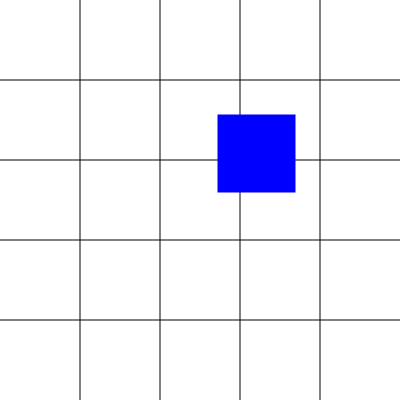

[Home](../README.md) | [Part 3](../Part3/part3.md) | [Part 5](../Part5/part5.md)


# Part 4

## Adding Event Listeners to the Canvas

In Part 3, we figured out how to draw the squares inside of our grid. Now, it's time to set it up so that the user can draw some squares.

### Finding the Coordinates of the Click

Before we can draw a square where the user has clicked, we need to figure out indeed where the user has clicked. But before we even do that, we need to add the event listener itself. So, under the event listener for the submit button...

```javascript
    canvas.onclick = function(event){
        event.preventDefault();
        console.log("clicked!");
    }
```

Once you have the event listener in place, you need to then figure out exactly where the click is. This can be done with _event.mouseX_ and _event.mouseY_. 

```javascript
    canvas.onclick = function(event){
        event.preventDefault();

        let x = event.clientX;
        let y = event.clientY;

        console.log("x: " + x + " y: " + y);
    }
```

But that's only half the battle because _event.clientX_ and _event.clientY_ are the coordinates of the click _relative to the page_, and we don't want that. We want to be able to find the mouseclick's position _on the canvas_. In order to do that, we have to figure out the exact measurement of the top and left margins of the canvas. We can do that with _getBoundingClientRect()_ method, which returns an object that contains infirmation about an element's size and its position relative to the viewport. 

Once we have that information, we just subtract the left and top margins from _event.clientX_ and _event.clientY_, respectively. For example:

```javascript
canvas.onclick = function(event){
    event.preventDefault();

    let margin = this.getBoundingClientRect();
        
    let x = event.clientX - margin.left;
    let y = event.clientY - martgin.top;

    console.log("x: " + x + " y: " + y);
}
```

## Drawing on the Grid

Now that we have the coordinates of the click, it should be as simple as plugging these coordinates into the _drawSquare_ function, right?  Let's try that........

```javascript
canvas.onclick = function(event){
    event.preventDefault();

    let margin = this.getBoundingClientRect();
        
    let x = event.clientX - margin.left;
    let y = event.clientY - martgin.top;

    drawSquare(x, y, "blue"); //I'm tired of red
}
```

And I got this ...

 

Not exactly what we wanted, is it? This is why the _getBoundingClientRect_ was so important. We wanted it to draw _inside the grid lines_. In order to do that, we have to use the _modulus_ (%) operator. 

### The Modulus Operator

Basically, what the modulus operator does is takes the first number and calculates the remainder after dividing by the second number. So, 10 % 3 = 1, since the remainder of dividing 10 by 3 is 1. What does the have to do with the grid? Well, since we want the squares to be drawn inside of grid squares, we have to trim off the space that is inside the square.

```javascript
    function findIndex(num, size) {
        num = num - (num % size);
        return (num === 0) ? num : num + 1; //If the index is zero, I want to add one so that doesn't go into the edge of the canvas
    };
```
After we have this function added, we can...

```javascript
    x = findIndex(x, squareWidth);
    y = findIndex(y, squareHeight);
```
Now, when you click on the canvas, it should draw the square exactly where it's supposed to.


Now that we can let the user draw squares on the grid, letting them choose the color is as simple as grabbing the color picker from the DOM...

```javascript
    const colorPicker = document.getElementById("color-picker");
```

and then changing the _color_ parameter in the _drawSquare_ function...

```javascript
    drawSquare(x, y, colorInput.value);
```
Now, if you are part of Udacity's _Grow with Google_ Scholarship program, all of the final project's basic requirements are fufilled at the end of this section. However, there are a few more features I could show you how to add. In Part 5, we will be adding the pallette to store a history of the colors you have chosen. 

[Home](../README.md) | [Part 3](../Part3/part3.md) | [Part 5](../Part5/part5.md)